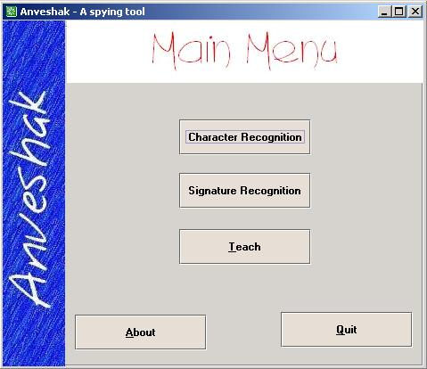



## Signature and Handwriting Recogniton

### Description

hi friends, after getting your feedbacks, i finally decided to upload the new version after removing all those stuff that used to hide desktop. For those who doesnt know what this program is all about, I would like to introduce once again. This program is meant for recognizing characters and signatures. The logic of program revolves around the concepts of Artificial Intelligence, since you are also able to teach computer, the way you write your characters...

This is what i am going to submit as my final semester project in my college this december 2002. I would be more than happy to receive your feedbacks and suggestions, so as to further improve this system, before my final submissions.

Regards,

Vikrant Thakker
 
### More Info
 

             |
---                |---
**Submitted On**   |2002-08-11 11:44:52
**By**             |[Vikrant Thakker](https://github.com/Planet-Source-Code/PSCIndex/blob/master/ByAuthor/vikrant-thakker.md)
**Level**          |Advanced
**User Rating**    |4.8 (91 globes from 19 users)
**Compatibility**  |VB 6\.0
**Category**       |[Complete Applications](https://github.com/Planet-Source-Code/PSCIndex/blob/master/ByCategory/complete-applications__1-27.md)
**World**          |[Visual Basic](https://github.com/Planet-Source-Code/PSCIndex/blob/master/ByWorld/visual-basic.md)
**Archive File**   |[Signature\_1216218232002\.zip](https://github.com/Planet-Source-Code/vikrant-thakker-signature-and-handwriting-recogniton__1-38215/archive/master.zip)

